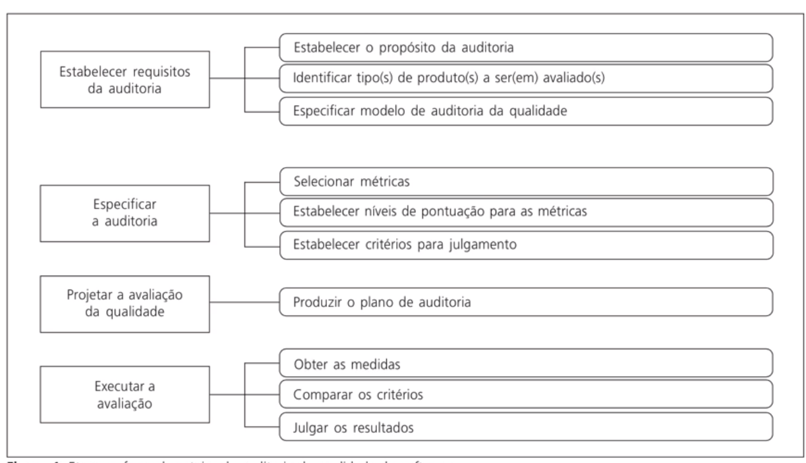
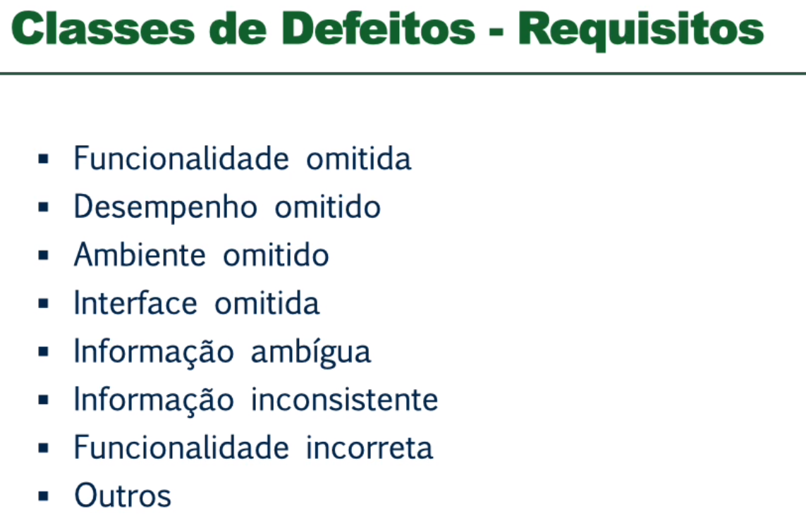

# Análise estática x Análise Dinâmica

## Estática

- Não é necessário uma versão exec do programa
- Pode ser executada em qualquer etapa de desenvolvimento
- Pode ser automática (Sonarcloud)
- Permite verificação correspondência entre um programa e sua especificação
- **Não** permite demonstrar que o software é útil operacionalmente.
- **Não** permite verificar propriedades emergentes como desempenho e confiabilidade.

### Exemplos

- Inspeções de software
  - Avaliação por pares.

### Vantagens

- A realização de inspeções é mais eficiente em detectar defeitos do que testes de software.
    - Em uma única sessão de inspeção pode identificar vários erros.
- Mais eficiente e barato de realizar softwares.
- 60% dos erros podem ser detectados usando-se inspeções informais.
- Versões incompletas podem ser avaliadas sem custos adicionais.
- Analisa se o código possui uma boa qualidade, importante para manutenções futuras.
- Encontra o defeito e já sabe onde o mesmo está localizado

### Dificuldades

- Custos incorrem desde o início do desenvolvimento.
- Eng de Software relutam em aceitar que a inspeção é mais eficiente que os testes.
- Demoram tempo e parecem diminuir a velocidade do desenvolvimento.

### Técnicas

#### Verificação Estática

- Verificar consistência e completude dos documentos ou código.
- Certificar-se que os padrões ou normas aplicáveis foram seguidos
- Descobrir problemas no software ou na documentação do projeto.

#### Auditoria

- Revisores independentes
    - Equipe externa de devs
    - Equipe externa à organização
- Utilização de checklists e questionários
- Embasamento em normas e padrões da área.
- Difícil encontrar auditores experientes

#### Revisão por pares

- É um processo de revisão em que os pares revisam aspectos do ciclo de vida e dev que lhes são mais familiares
- Autor e revisor executam a mesma função
- Deve ser estruturada
- Realizada com base em checklists

#### Walkthroughs

- Checagem do produto em que dados de teste são conduzidos através do código
- Pode ser multidisciplinar: Equipe faz perguntas e levanta questionamentos.
- Menos estruturada, apenas procedimentos básicos

#### Inspeções

- Revisões estruturadas
- Produto é avaliado contra critérios de entrada ou contra especificações do produto
- Revisão minuciosa
- Utiliza checklist

##### Equipe

- Autor
    - Cria ou mantém código.
    - Efetua correções.
    - Apresenta produtos.
- Revisor
    - 1 ou mais.
    - Avaliam produtos.
- Moderador
    - Coordena inspeção.
    - Garante que o procedimento está sendo seguido.
    - Acompanhar correção dos defeitos.
    - Moderar conflitos.

##### Etapas

- Apresentar produto
- Revisar produto
- Reunião da equipe
- Corrigir defeitos
- Verificar correção realizada

#### Classes de Defeitos

#### Análise estática automática

- Classes de defeitos de códigos podem ser verificadas por um processo automático
- Barato de utilizar.
- Pode ser usado como parte do processo de inspeção

## Dinâmica

- Exercita o programa com dados reais
- Verifica se saídas obtidas estão de acordo com as saídas esperadas
- Só é possível quando um protótipo ou versão executável está disponível.

### Exemplos

- Testes de software
    - Testar a partir de testes unitários