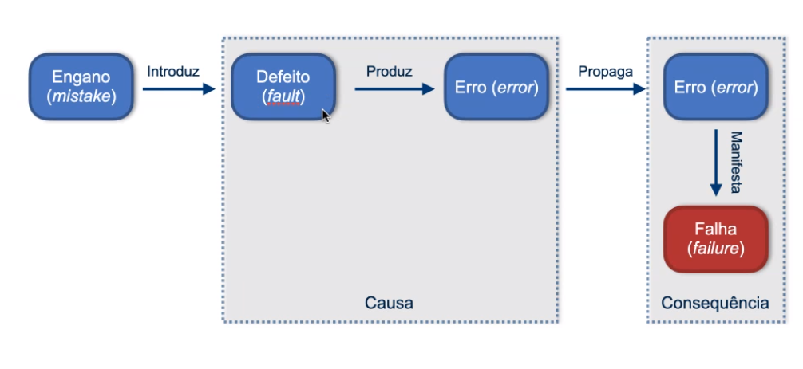

# Aula 28/07
 
## Verificação
 
- Envolve verificar se o software está de acordo com suas especificações
- Atende aos requisitos funcionais e não funcionais?
- Atividade mais técnica
- Todos os artefatos de um projeto podem ser submetidos à verificação.
 
### Por que realizar?
 
- Grande parte do esforço de um projeto é gasto com retrabalho.
- O custo de correção de defeitos cresce à medida que o projeto avança pelas fases de desenvolvimento.
 
### Definição
 
- A confirmação de se o software realmente atende aos requisitos do cliente.
 
### Objetivos
 
- Assegura que os requisitos estabelecidos podem ser alcançados.
- Identificar os requisitos que não podem ser alcançados.
- Garantir que o software é desenvolvido de forma uniforme.
- Identificar erros para tomar medidas corretivas o mais cedo possível.
- Tornar o projeto mais gerenciável.
 
## Validação
 
- Assegurar se o software atende as expectativas do cliente.
- Vai além da especificação,
- Conhecimento do domínio da aplicação.
- Muito associada a verificação
 
### Definição
 
- Processo de examinar um produto para determinar sua conformidade com as necessidades do usuário.
 
## Abordagens de V&V
 
### Estáticas
 
- Não requerem a execução ou existência de um programa executável:
    - Revisões
    - Inspeções (Inspecionar qualidade de código)
    - Walkthrough
 
### Dinâmicas:
 
- Baseiam-se na execução de um programa:
    - Testes de software (Testes unitários).
    
## Teste
 
- Processo de executar um programa com a finalidade de encontrar erros ou não atender a especificação.
 
### Terminologia
 
- Engano/Mistake: Ação humana que produz resultado incorreto.
- Defeito/Fault (Bug): PAsso, processo ou definição de dados incorreto
- Erro/Error: Um estado interno inconsistente ou inesperado durante a execução de um programa.
- Falha/Failure: Comportamento externo incorreto, quando o resultado produzido por uma execução é diferente do resultado esperado.
 
 
  
 
 
 
